# ⚡ Data Cleaning & Reporting Automation

[](https://www.python.org/)
[](https://streamlit.io/)
[](https://pandas.pydata.org/)
[](https://plotly.com/)
[](https://www.reportlab.com/)
[](https://opensource.org/licenses/MIT)

> An enterprise-grade, end-to-end automated platform that transforms messy, unstandardized business datasets into clean, verified data with dynamic KPI calculations, interactive visual analytics, and multi-format publication-ready reports.

---

## 📌 1. Project Overview

Raw business data exported from CRMs, ERPs, payment gateways, and transactional databases often contains severe data hygiene issues:
- Currency formatting and non-numeric symbols (`₹50,000`, `$1,299.99`, `1,250`)
- Mixed, unparseable date formats (`12/08/2026`, `2026-08-15`, `Aug 20, 2026`)
- Inconsistent categorical casing and representations (`North`, `north`, `NORTH`, `North Region`)
- Missing values and blank whitespace strings
- Exact duplicate rows and negative anomalies in positive fields
- High-variance statistical outliers

**Data Cleaning & Reporting Automation** automates this entire pipeline into a unified, one-click workflow that profiles data health, fixes anomalies, computes domain KPIs, generates interactive charts, provides rule-based narrative insights, and exports styled multi-sheet Excel workbooks, executive PDF summaries, and interactive HTML dashboards.

---

## 🔄 2. Complete Automated Pipeline Workflow

```mermaid
graph LR
    A[Raw Data: CSV / Excel] --> B[Data Profiler & Health Scorecard]
    B --> C[Automated & Configurable Cleaner]
    C --> D[Feature Engineering & Transformation]
    D --> E[Before vs After Audit Validation]
    E --> F[Dynamic KPI & Analytics Engine]
    F --> G[Interactive Visualizations]
    G --> H[Automated Narrative Insights]
    H --> I[Multi-Format Export Studio: Excel, PDF, HTML, CSV]
```



### Pipeline Stages:
1. **Data Ingestion**: Multi-format loading supporting CSV (delimiter & encoding auto-detection) and Excel (`.xlsx`, `.xls` multi-sheet selection).
2. **Quality Assessment & Scoring**: Calculates a unified **Data Quality Health Score (0-100%)** across Completeness, Uniqueness, Validity, and Consistency.
3. **Automated Cleaning**:
   - `snake_case` column standardization
   - Exact duplicate record elimination
   - Currency symbol, comma, and percentage stripping with numeric casting
   - Multi-format date parsing with fallback
   - Negative value correction in strictly positive fields
   - Categorical normalization and whitespace trimming
   - Configurable missing value imputation (median/mean/mode/constant/drop)
   - Outlier detection (IQR / Z-Score) with keep/cap/remove controls
4. **Feature Engineering**: Context-aware date component extraction (`year`, `month`, `quarter`, `day_name`, `is_weekend`) and business metric calculation (`revenue = qty * price`, `profit`, `profit_margin_pct`, tier binning).
5. **Business KPI Intelligence**: Auto-detects schema to calculate Total Sales/Revenue, AOV, Units Sold, Unique Entities, Margin %, and Period Growth.
6. **Visual Analytics**: Interactive Plotly charts (Time-series trends, Category bar charts, Donut distributions, Outlier box plots, Correlation matrices).
7. **Automated Narrative Insights**: Factual, calculation-backed data quality findings and actionable strategic recommendations.
8. **Multi-Format Export Studio**:
   - **Styled Multi-Sheet Excel Workbook (`.xlsx`)**: Formatted with OpenPyXL (Executive Summary, Data Quality, Audit Trail, KPIs, Cleaned Data).
   - **Executive PDF Business Report (`.pdf`)**: Formatted using ReportLab with embedded charts, KPI tables, and recommendations.
   - **Standalone Interactive HTML Report (`.html`)**: Responsive web summary.
   - **Cleaned Dataset Direct Download (`.csv` / `.xlsx`)**.

---

## 📂 3. Project Directory Structure

```
Data Cleaning & Reporting Automation/
│
├── app.py                     # Main Streamlit web application & UI dashboard
├── requirements.txt           # Project dependencies
├── README.md                  # Comprehensive documentation
├── conftest.py                # Pytest path configuration
├── generate_sample_data.py    # Generator script for realistic messy datasets
│
├── data/
│   ├── raw/                   # Sample messy business datasets
│   │   ├── messy_sales_data.csv
│   │   ├── messy_customer_data.xlsx
│   │   ├── messy_employee_data.csv
│   │   └── messy_financial_data.xlsx
│   └── processed/             # Export directory for cleaned datasets
│
├── reports/                   # Generated Excel, PDF, and HTML reports
│
├── src/                       # Core modular Python engineering engine
│   ├── __init__.py
│   ├── logger.py              # Structured logging & in-memory audit trail
│   ├── data_loader.py         # Multi-format CSV/Excel loader & profiler
│   ├── validator.py           # Data quality diagnostics & health scorecard
│   ├── cleaner.py             # Customizable data cleaning pipeline
│   ├── transformer.py         # Feature engineering & derived business metrics
│   ├── analyzer.py            # Dynamic KPI calculation & statistical summaries
│   ├── visualizer.py          # Interactive Plotly & static Matplotlib charts
│   ├── insights.py            # Rule-based calculation-backed insights engine
│   └── report_generator.py    # Multi-format reporting (Excel, PDF, HTML, CSV)
│
├── notebooks/
│   └── data_cleaning_analysis.ipynb # Interactive step-by-step Jupyter Notebook
│
├── tests/
│   └── test_cleaning.py       # Comprehensive pytest test suite (12 test cases)
│
└── logs/                      # Persistent execution logs
```

---

## 🚀 4. Installation & Setup

### Prerequisites
- Python 3.10 or higher
- pip package manager

### 1. Clone or Open Project
```bash
git clone https://github.com/amitkush7373-prog/Data-Cleaning-Reporting-Automation.git
cd Data-Cleaning-Reporting-Automation
```

### 2. Create and Activate a Virtual Environment (Recommended)
```bash
# Windows
python -m venv venv
venv\Scripts\activate

# macOS / Linux
python3 -m venv venv
source venv/bin/activate
```

### 3. Install Dependencies
```bash
pip install -r requirements.txt
```

---

## 🖥️ 5. Running the Application

### Launch Streamlit Dashboard:
```bash
streamlit run app.py
```

Open your browser at `http://localhost:8501` to interact with the dashboard.

### Dashboard Highlights:
- **One-Click Sample Datasets**: Instantly test on pre-loaded Sales, Customer, Employee, and Financial datasets.
- **File Uploader**: Drag and drop any custom CSV or Excel file.
- **Granular Cleaning Controls**: Customize missing value strategies, outlier handling (keep, cap, remove), and type conversions from the sidebar.
- **Live Search & Filter**: Filter thousands of rows with pagination and full-text keyword search.
- **Multi-Format Export**: One-click downloads for Styled Excel (.xlsx), PDF, HTML, and CSV.

---

## 🧪 6. Running Automated Tests

Run the full pytest test suite:
```bash
python -m pytest tests/ -v
```

All 12 test suites validate:
- Multi-format file loading & delimiter detection
- Missing value imputation strategies
- Exact duplicate removal & tracking
- `snake_case` column naming standardization
- Currency symbol & comma stripping
- Multi-format datetime parsing
- IQR & Z-score outlier detection & capping
- KPI & statistical aggregation calculations
- Multi-sheet Excel, PDF, HTML, and CSV report export
- Empty dataset & edge case handling

---

## 📊 7. Supported Datasets & Sample Files

The repository includes 4 realistic business datasets with intentional data quality issues:

| Dataset | Format | Size | Intentional Quality Issues Included |
| :--- | :--- | :--- | :--- |
| **Sales Transactions** | CSV | 160+ rows | Currency strings (`$`, `₹`), missing customer names, duplicate orders, negative quantities/prices, mixed dates (`YYYY-MM-DD`, `DD/MM/YYYY`, `Month DD, YYYY`), region typos (`North Region`, `NORTH`). |
| **Customer Directory** | Excel | 120+ rows | Inconsistent genders (`M`, `male`, `Male`, `FEMALE`), dirty phone numbers (`+91`, `hyphens`), whitespace in emails, negative income/credit score anomalies. |
| **Employee Records** | CSV | 105 rows | Formatted salaries, missing departments, unstandardized locations, invalid ratings. |
| **Financial Ledger** | Excel | 27 rows | Quarter labels, revenue vs operating expenses, currency symbols, unparsed tax percentages. |

To regenerate fresh sample data at any time:
```bash
python generate_sample_data.py
```

---

## 📑 8. Multi-Format Report Outputs

| Report Format | Extension | Key Features |
| :--- | :--- | :--- |
| **Styled Multi-Sheet Excel Report** | `.xlsx` | Built with OpenPyXL. Includes 5 formatted tabs: `Executive Summary`, `Data Quality`, `Cleaning Audit Trail`, `KPIs and Breakdowns`, and `Cleaned Data`. Features navy/blue banners, styled headers, and auto-fitted columns. |
| **Executive Business PDF Report** | `.pdf` | Built with ReportLab. Includes formal cover title, Data Health Scorecard, KPI table, embedded visual chart snapshot, automated insights, and strategic recommendations. |
| **Interactive HTML Report** | `.html` | Standalone single-page responsive web report with CSS metric cards, audit log, insights, and data preview. |
| **Cleaned Dataset** | `.csv` / `.xlsx` | Clean, ready-to-use tabular data formatted for production databases or BI tools (PowerBI, Tableau). |

---

## 🛡️ 9. Data Quality Health Score Formula

The unified **Data Quality Health Score (0 - 100%)** is calculated across 4 weighted dimensions:

$$\text{Health Score} = (0.35 \times \text{Completeness}) + (0.25 \times \text{Uniqueness}) + (0.25 \times \text{Validity}) + (0.15 \times \text{Consistency})$$

- **Completeness Score (35%)**: Penalizes missing cells across all columns.
- **Uniqueness Score (25%)**: Penalizes duplicate rows.
- **Validity Score (25%)**: Penalizes negative anomalies in strictly positive fields and whitespace-only strings.
- **Consistency Score (15%)**: Penalizes non-standard column headers and unparsed dirty data types.

**Grade Bands**:
- `90 - 100`: **A+ (Excellent)**
- `80 - 89`: **A (Good)**
- `70 - 79`: **B (Acceptable)**
- `50 - 69`: **C (Needs Attention)**
- `< 50`: **D (Critical Data Quality Issues)**

---

## 🔮 10. Future Enhancements

- [ ] Support for direct database ingestion (PostgreSQL, MySQL, Snowflake).
- [ ] Integration with cloud storage (AWS S3, Google Cloud Storage, Azure Blob).
- [ ] Advanced anomaly detection using Isolation Forests and Autoencoders.
- [ ] Scheduled automated batch processing with email report delivery.

---

## 📜 11. License

This project is licensed under the MIT License — see the [LICENSE](LICENSE) file for details.
